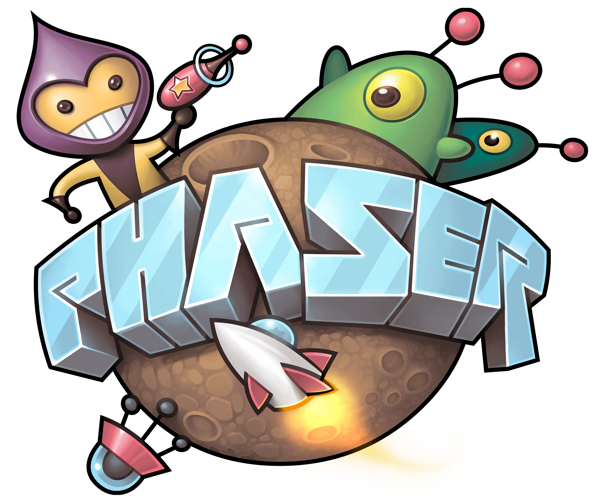
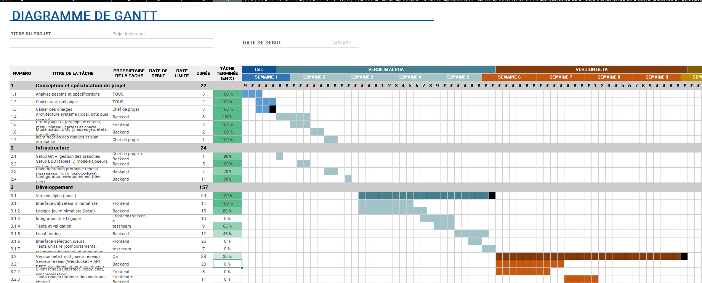
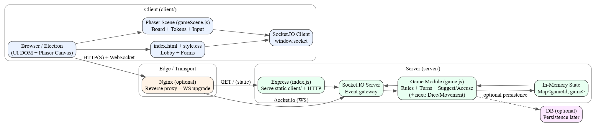

# Cluedo - Real-Time Multiplayer Online Game


A production-grade, full-stack multiplayer adaptation of the classic Cluedo board game - engineered with a server-authoritative game engine, a real-time WebSocket event protocol, a Phaser 3 rendered board, and distributed as both a live web application and a cross-platform native desktop application via Electron.

The system handles up to 6 concurrent players per match with full state synchronization, private information enforcement, structured multi-step interaction flows, and resilient disconnect recovery - all coordinated through a custom-built rules engine running on Node.js.

> **Available across all platforms** - accessible as a **web application** in any modern browser, fully **mobile-responsive** for on-the-go play, and distributed as a **native desktop application** for both **Windows** and **Linux** via Electron.

> **Engineering Note - No Frameworks, By Design:** The client layer is built entirely in **Vanilla JavaScript and native CSS** - no React, no Vue, no Tailwind, no abstraction layer of any kind. This is a deliberate architectural constraint, not a limitation. The goal was to demonstrate mastery of the primitives that frameworks are built on top of: raw DOM manipulation, manual event propagation, hand-rolled state synchronisation between client and server, explicit lifecycle management, and CSS layout systems from first principles. Building a real-time multiplayer game without framework scaffolding exposes the full complexity of the problem domain - the same class of problems that game engines like Unity or Unreal abstract behind their own systems. Coordinating Phaser's frame-driven `update()` loop with an asynchronous Socket.IO event stream, keeping DOM-based UI state consistent with server-authoritative game state across concurrent socket connections, and managing rendering invalidation manually are problems a reactive framework would typically obscure entirely. Solving them at the primitive level builds a precise, transferable understanding of how event queues, rendering pipelines, and state propagation actually behave under the hood.

---

## Engine & Rendering

This project is built around two core systems: a **custom server-authoritative game engine** written in Node.js, and a **Phaser 3 rendering pipeline** for the interactive board.

### Custom Game Engine

The game engine runs entirely on the server - a deliberate architectural decision that makes client-side manipulation impossible by design. Every player action (movement, suggestion, accusation, disproof) is validated server-side before any state mutation occurs. The engine manages:

- **Match registry** - concurrent games stored in a `Map<gameCode, GameState>`, each fully isolated with zero shared state between matches
- **Turn controller** - handles turn sequencing, elimination-aware skipping, and automatic advance logic
- **Suggestion FSM** - a multi-step finite state machine coordinating the private disproof chain across up to 5 concurrent socket connections without race conditions
- **Disconnect handler** - 4-second grace period, automatic disproof resolution, hand revelation, and host reassignment on mid-game player drop

### Phaser 3 - Board Rendering

<p align="center">
  
</p>

The game board is rendered using **Phaser 3**, a production-grade HTML5 game framework that offloads all rendering to the GPU via WebGL (with Canvas fallback). The 25×25 board is constructed as a tile grid with per-cell type encoding - rooms, corridors, walls, door cells, spawn points, and secret passage cells. Player tokens are sprite-based with smooth step-by-step movement driven by Phaser's tween system. The Phaser scene lifecycle (`preload → create → update`) is fully decoupled from the Socket.IO event bus, with `client.js` acting as the coordination layer between incoming server events and live scene mutations.

---

## Live Demo

### Full Demo

<video src="Cluedo_video.mov" controls width="100%">
  Your browser does not support the video tag.
</video>

---

## Project Timeline



The Gantt chart above maps the full delivery schedule across all project phases, from initial scope definition through final release. The project was executed under a fixed deadline with no schedule buffer, requiring continuous backlog grooming and critical path discipline to protect the delivery date.

**Phase 1 - Requirements & Scope Definition:** Stakeholder requirements were captured and translated into a prioritised feature backlog. Architecture decisions were locked early to prevent scope creep downstream. Deliverables: functional specification, system architecture document, and technology stack decision record.

**Phase 2 - Core Engine & Transport Layer (MVP):** The server-authoritative game engine, Socket.IO event protocol, and turn controller formed the critical path. All subsequent feature work was blocked on this foundation. The phase gate criterion was a stable, playable two-player loop with validated state transitions.

**Phase 3 - Feature Delivery Sprints:** Iterative delivery of the full feature set - board movement system, suggestion/disproof state machine, accusation flow, detective's notebook, in-game chat, and audio engine. Each sprint targeted a shippable increment with defined acceptance criteria per user story.

**Phase 4 - Integration, QA & Hardening:** End-to-end integration testing across all game paths, disconnect resilience validation, and edge case coverage (elimination logic, auto-disproof, host reassignment). Defects were triaged by severity and resolved before the release gate.

**Phase 5 - Distribution & Deployment:** Electron packaging for Windows and Linux, Render deployment configuration, and production environment validation. Final release baseline locked at **V1.0.4**.

The schedule was managed with a single owner across all workstreams - product definition, architecture, full-stack implementation, QA, and release - with no external dependencies and no team escalation path. All milestones were delivered within the committed timeline.

### Gameplay Preview


---

## Technical Highlights

- **Custom server-authoritative game engine** - all rule validation, state transitions, turn management, and win condition evaluation execute exclusively on the server. No client can influence game state without passing server-side validation gates.
- **Real-time bidirectional event protocol** over persistent WebSocket connections via Socket.IO - gameplay actions are modeled as typed events that map 1:1 to state machine transitions, eliminating polling entirely.
- **Phaser 3 rendering pipeline** - the 25×25 board is rendered on a hardware-accelerated canvas using Phaser's scene lifecycle, with sprite-based player tokens, tile-based room and corridor rendering, and smooth movement animations.
- **Multi-step asynchronous state machine** for the suggestion→disproof interaction - server-side pending state tracks the active suggestion, the current responder index, and private card visibility, preventing race conditions across concurrent socket connections.
- **Room-scoped broadcast isolation** via Socket.IO rooms - each match occupies a dedicated namespace room; zero cross-match data leakage is possible by architectural design.
- **Graceful disconnect resilience** - handles mid-game player drops with automatic host reassignment, turn correction, auto-disproof resolution, and hand revelation to remaining players.
- **Cross-platform desktop distribution** via Electron - the same client codebase is packaged into native installers for Windows, macOS, and Linux without maintaining a separate UI layer.

---

## Feature Set

### Gameplay
- 2 to 6 players per match with real-time synchronization across all connected clients
- Full 25×25 Cluedo board with 9 rooms, interconnecting corridors, 6 spawn points, and room seat positions
- Dice-based movement system (2d6) with step-by-step traversal, directional validation, and backtrack prevention
- Direction-constrained room entry and exit through named door cells
- Secret passage teleportation between the four corner rooms (Kitchen ↔ Library, Lounge ↔ Conservatory)
- Player summoning mechanic - naming a suspect in a suggestion physically teleports their token to the current room
- Structured suggestion → private disproof → card reveal flow with strict privacy boundaries
- Accusation system with immediate win resolution or player elimination with card broadcast
- Eliminated players remain as observers; the match continues until a winner is determined

### Interface & UX
- Phaser 3 board scene with character sprite tokens and animated movement
- Visual accusation and suggestion modal with image-based card selection
- Detective's notebook with per-card status cycling (unknown → possible → ruled out → confirmed)
- Automatic notebook updates on card deals, eliminations, and disconnections
- Real-time in-game chat with emoji picker
- Full audio system - background music with volume control, 8 distinct sound effects mapped to game events
- Responsive layout with collapsible mobile panels for all screen sizes
- Settings panel with audio controls, display options (fullscreen, colorblind mode), and profile management
- Animated result screen with suspect, weapon, and room card reveal

### Infrastructure
- User authentication with account creation, login, and credential recovery
- Session management with per-match game codes
- Electron desktop app pointing at the live deployment - single codebase, zero duplication
- Deployed on Render with persistent Node.js process and WebSocket support

---

## Game Contents

### Suspects
| Character | Colour |
|---|---|
| Miss Scarlett | Red |
| Colonel Mustard | Yellow |
| Mrs. White | White |
| Mr. Green | Green |
| Mrs. Peacock | Blue |
| Professor Plum | Purple |

### Weapons
Candlestick · Knife · Lead Pipe · Revolver · Rope · Wrench

### Rooms
Kitchen · Ballroom · Conservatory · Dining Room · Billiard Room · Library · Lounge · Hall · Study

---

## Technology Stack

| Layer | Technology | Role |
|---|---|---|
| Board Rendering | **Phaser 3** | Hardware-accelerated canvas scene, sprite management, tile rendering, animation |
| Frontend Logic | **Vanilla JavaScript** | Socket event handling, UI state machine, notebook logic, modal orchestration |
| Realtime Transport | **Socket.IO 4** | Persistent WebSocket connections, room-scoped broadcasting, event protocol |
| HTTP Server | **Express 5** | Static asset delivery, REST API endpoints |
| Game Engine | **Node.js** | Server-authoritative rules engine, in-memory state management, event dispatch |
| Desktop Runtime | **Electron** | Cross-platform native app wrapper, BrowserWindow lifecycle, IPC bridge |
| Deployment | **Render** | Persistent Node.js web service, zero-sleep production hosting |

---

## Infrastructure Architecture



The system is structured across three distinct layers with strict communication boundaries:

**Client Layer** - a single-page application serving as a pure view layer. `index.html` manages all screens (auth, lobby, HUD, modals); `gamescene.js` owns the Phaser 3 canvas scene; `client.js` acts as the event bus between the two, translating socket events into UI state transitions and user actions into outbound socket emissions.

**Transport Layer** - `server/index.js` binds an Express 5 HTTP server and a Socket.IO server on the same port, handling both static file delivery and WebSocket connections. Socket.IO rooms provide strict per-match broadcast isolation: `io.to(gameCode).emit(...)` is the only broadcast primitive used throughout the engine.

**Game Engine** - `server/game.js` is the single source of truth for all game state. It maintains a `Map<gameCode, GameState>` registry of active matches and processes all client events through validation gates before mutating state. No state transition is possible without passing through this layer.

### Core Design Principles

**Server-authoritative enforcement** - the client is a pure view layer. Every action emitted by a client (move, suggest, accuse, disprove) passes through validation gates on the server before any state mutation occurs. This makes it impossible to perform illegal moves, skip turns, or manipulate game state from the browser.

**Event-driven state machine** - gameplay is expressed as a finite set of named socket events that trigger well-defined state transitions. This makes the protocol auditable, testable, and easy to extend without side effects.

**Room-scoped isolation** - Socket.IO rooms ensure that every broadcast (turn updates, board positions, suggestions, results) is strictly confined to the players of a single match. There is no shared global state between concurrent games.

**Pending state concurrency control** - the multi-player suggestion→disproof flow is inherently asynchronous. A server-side pending object serializes the interaction, ensuring exactly one responder is queried at a time and that no race conditions can produce duplicate disproves or premature turn advancement.

---

## How to Play

1. **Create an account** and log in with your detective alias
2. **Create a game** - a unique 4-character case code is generated; share it with other players
3. **Join a game** - enter the case code provided by the host
4. **Select a character** - each player reserves one of the 6 suspects before the match begins
5. **Host starts the match** - the system secretly draws one suspect, one weapon, and one room as the solution; remaining cards are dealt evenly among players
6. **Take turns** - roll the dice, move across the board step by step, and enter rooms
7. **Make suggestions** - once inside a room, suggest a suspect + weapon. Players are queried in order; the first one holding a matching card privately shows it to you
8. **Build deductions** - use your notebook to track ruled-out cards and narrow down the solution
9. **Make an accusation** when certain - a correct accusation wins the game immediately; an incorrect one eliminates you (you remain as an observer)
10. **Win** by being the first to correctly identify the suspect, weapon, and room

### End Conditions

| Situation | Outcome |
|---|---|
| Correct accusation | That player wins; the full solution is revealed to all |
| All but one player eliminated | Last remaining player wins by default |
| Player disconnects mid-game | Game continues; their cards are revealed and ruled out |

---

## Running Locally

```bash
cd server
npm install
node index.js
```

Open `http://localhost:3000` in two or more browser tabs to test multiplayer locally. No additional configuration required.

---

## Project Structure

```
00-Cluedo-multiplayer-game-online/
├── client/
│   ├── assets/
│   │   ├── audio/               - 8 WAV sound effects + background music track
│   │   └── ui/
│   │       ├── rooms/           - Room card images (9)
│   │       ├── suspects/        - Character portrait images (6)
│   │       └── weapons/         - Weapon card images (6)
│   ├── index.html               - Single-page application shell + all screen views
│   ├── client.js                - Socket.IO event handling, UI orchestration, notebook logic
│   ├── gamescene.js             - Phaser 3 board scene, token management, movement rendering
│   └── style.css                - Full responsive stylesheet
└── server/
    ├── index.js                 - Express server, Socket.IO bootstrap, REST auth endpoints
    ├── game.js                  - Complete game engine: board, rules, state machine, events
    └── package.json
```

---

## Socket Event Protocol

| Client → Server | Description |
|---|---|
| `create_game` | Initialize a new match, generate a game code |
| `join_game` | Join an existing pre-start lobby by code |
| `select_character` | Reserve a suspect character; real-time availability sync |
| `start_game` | Host-only: trigger solution draw, card deal, board initialization |
| `roll_dice` | Request a 2d6 roll; server resolves exit door logic for rooms |
| `move_step` | Submit a directional move; server validates against move budget and board rules |
| `use_secret_passage` | Teleport to the paired corner room; consumes movement for the turn |
| `select_exit_door` | Choose which door to exit when a room has multiple exits |
| `make_suggestion` | Submit a suspect + weapon claim; triggers the disproof state machine |
| `disprove` | Submit a card to privately reveal to the suggester |
| `make_accusation` | Submit a final claim; server evaluates against hidden solution |
| `end_turn` | Explicitly close the current turn; validated against pending state and move budget |
| `chat_message` | Broadcast a message to all players in the match |
| `leave_game` | Voluntarily exit; triggers disconnect cleanup |

---

## License

Developed as an integrator project at the University of Strasbourg.
