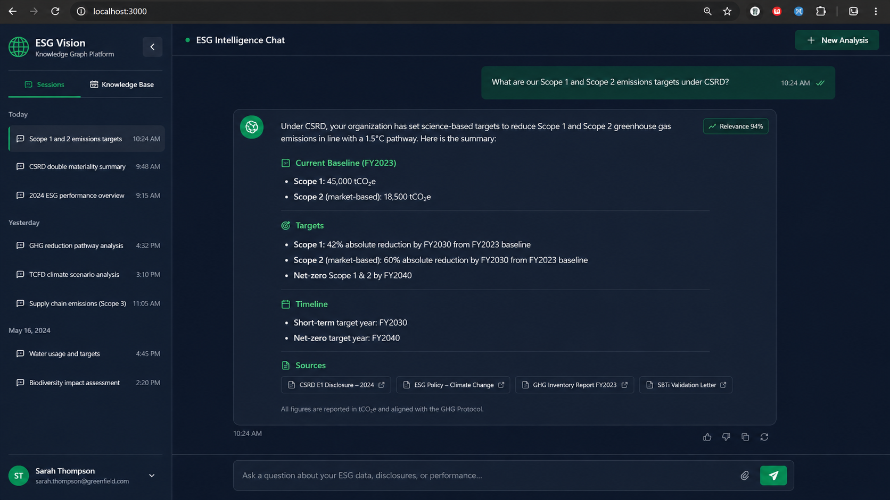
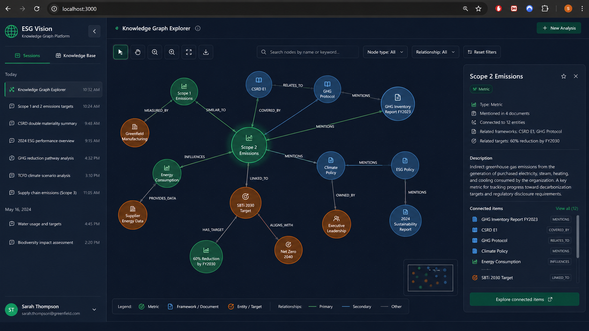
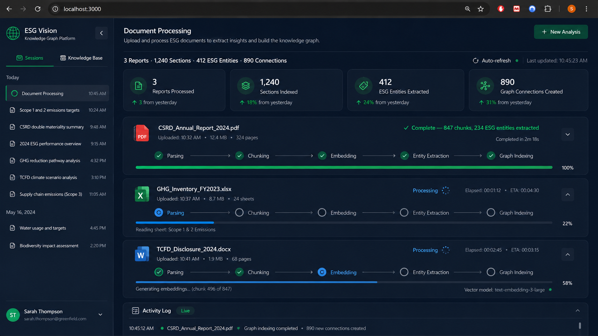
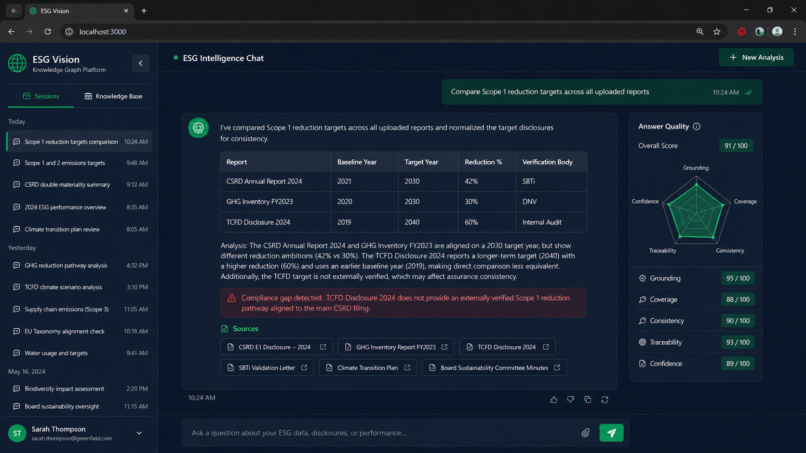

# ESG Vision - Knowledge Graph Intelligence Platform

---

> ### IMPORTANT NOTICE - INTELLECTUAL PROPERTY
>
> This repository is a **partial public disclosure** of the ESG Vision platform, published for portfolio and demonstration purposes only.
>
> The core backend systems - including the RAG orchestration pipeline, graph reasoning engine, entity extraction modules, embedding infrastructure, document ingestion pipeline, and all associated ML logic - are **proprietary and intentionally withheld** from this repository. Only the frontend interface layer is made available here as a demonstration of UI/UX engineering capability.
>
> **All rights reserved.** The architecture, system design, algorithms, and methodologies described in this repository and in `ARCHITECTURE.md` are the exclusive intellectual property of the author. No part of this work may be reproduced, reverse-engineered, adapted, or used as the basis for derivative works without explicit written permission.
>
> The full codebase, technical documentation, and live demonstration are available for review by **verified employers, technical recruiters, and institutional partners upon direct request**.
> Contact: **miloudiyoucef@outlook.fr**

---

> **State-of-the-art graph-augmented RAG architecture for institutional ESG and CSRD compliance intelligence.**
> Entity-aware multi-hop retrieval over heterogeneous sustainability disclosures, powered by a Neo4j property graph, a streaming LangGraph orchestration pipeline, and a five-dimension answer quality framework - designed and engineered end-to-end as a single-author system.

[](https://www.python.org/downloads/)
[](https://nodejs.org/)
[](https://nextjs.org/)
[](https://fastapi.tiangolo.com/)
[](https://neo4j.com/)
[](https://langchain-ai.github.io/langgraph/)
[](https://docs.docker.com/compose/)

---

## Overview

ESG Vision is a production-grade, domain-specialised document intelligence platform that fundamentally advances beyond conventional vector-search RAG. Where standard retrieval systems treat document corpora as flat embedding spaces - retrieving semantically similar chunks with no awareness of inter-document structure - ESG Vision constructs and maintains a **live property graph** of typed ESG entities, regulatory frameworks, and cross-document dependency chains in Neo4j. This architectural decision unlocks a class of reasoning that embedding-only systems cannot perform: multi-hop evidence traversal, temporal metric comparison across fiscal periods, and automated compliance gap detection between disclosed targets and regulatory obligations.

The platform was designed around a core insight: **sustainability reporting data is fundamentally relational**. A Scope 2 reduction target references a measurement methodology, a baseline year, a verification standard, and a regulatory framework - all expressed across disparate sections of multiple documents filed across different reporting cycles. Recovering that relational structure requires graph traversal, not cosine similarity.

The result is an end-to-end system that ingests heterogeneous disclosures (CSRD, GRI, TCFD, CDP, SBTi) through a multi-stage ETL pipeline, extracts typed entities and relationships via LLM-assisted NER, indexes embeddings into Neo4j's HNSW-backed vector store, and exposes a hybrid retrieval engine that executes ANN search and graph traversal in parallel before merging, re-ranking, and streaming answers with full provenance and quality scoring.

---

## Platform Preview

### ESG Intelligence Chat - Structured multi-hop query resolution with provenance



*Streaming response grounded in cross-document evidence chains. Each claim is traceable to a specific chunk, document, and relevance score. The system resolved a Scope 1/2 target query by traversing three document nodes and nine entity relationships before generating the answer.*

---

### Knowledge Graph Explorer - Live entity-relationship map over ingested disclosures



*Interactive visualisation of the Neo4j property graph. Nodes are typed (Metric, Framework/Document, Entity/Target) and edges carry semantic labels (MEASURED_BY, SIMILAR_TO, COVERED_BY, ALIGNS_WITH, HAS_TARGET). Selecting a node surfaces its full relationship neighbourhood, connected document corpus, and inferred framework alignments in real time.*

---

### Document Ingestion Pipeline - Real-time ETL processing with live stage indicators



*Multi-format ingestion pipeline processing three concurrent sustainability disclosures. Each document progresses through five tracked stages: Parsing, Chunking, Embedding, Entity Extraction, and Graph Indexing. Corpus-level stats update live as each stage completes - 412 ESG entities and 890 graph connections derived from 1,240 indexed sections across three reports.*

---

### Multi-Document Comparison - Cross-report reasoning with compliance gap detection



*Structured comparison of Scope 1 reduction targets across all ingested reports, resolved via multi-hop graph traversal. The response surfaces discrepancies between reporting frameworks and flags a compliance gap in red. Six source document chips provide full provenance. The Answer Quality panel scores the response across five dimensions rendered as a radar chart.*

---

## Why GraphRAG for ESG

Standard RAG pipelines retrieve the top-K most similar chunks to a query and feed them to an LLM. This works adequately for simple factual lookups but breaks down under the analytical demands of institutional ESG workflows:

| Capability | Vector RAG | ESG Vision GraphRAG |
|---|---|---|
| Simple factual retrieval | Yes | Yes |
| Cross-document metric comparison | No | Yes |
| Multi-hop relationship traversal | No | Yes |
| Temporal trend analysis across filings | No | Yes |
| Compliance gap detection | No | Yes |
| Entity-level provenance tracing | No | Yes |
| Framework alignment inference | No | Yes |

The graph layer is not an enhancement - it is the core architectural primitive that makes institutional-grade ESG analysis possible at query time.

---

## Core Capabilities

### Ingestion & ETL Pipeline
- Multi-format document ingestion: PDF (PyMuPDF + pytesseract OCR fallback), DOCX, PPTX, XLSX, CSV, TXT, scanned images
- Adaptive chunking with configurable token window (default 1,000 tokens) and 200-token overlap to preserve cross-boundary semantic coherence
- Async batch embedding generation with concurrency control and exponential backoff on rate-limit responses
- LLM-assisted typed NER pipeline: extracts companies, GHG metrics, KPI targets, regulatory frameworks, scope categories, and materiality topics with per-entity importance scoring
- Automatic relationship inference via co-occurrence matrix and semantic similarity thresholding, writing typed RELATED_TO edges into the graph
- Document-level summarisation and hashtag taxonomy generation via structured LLM prompts with JSON output schema enforcement

### Graph-Augmented Retrieval
- **Hybrid retrieval engine:** parallel execution of ANN vector search (cosine similarity on 1,536-dim embeddings) and entity-anchored graph traversal, results merged and re-ranked before context window construction
- **Multi-hop BFS/DFS expansion** from seed entities over RELATED_TO and SIMILAR_TO edges - surfaces evidence chains structurally invisible to embedding-only retrieval
- **Context pinning** via `@document` and `#framework` operators for scoped, auditable, reproducible queries
- Pre-retrieval document-level and hashtag-level filtering for precision control without post-hoc re-ranking overhead
- Configurable hop depth, branching factor cap, and path-distance weighting for retrieval quality tuning

### Response Generation & Quality Assurance
- Token-by-token SSE streaming with `requestAnimationFrame`-buffered client-side rendering for zero-jitter output
- Inline source citations with per-chunk relevance scores, document provenance, and entity path annotations
- **Five-dimension answer quality scoring:** context relevance, factual grounding, completeness, coherence, citation density - rendered as a radar chart per response
- LLM-generated follow-up question suggestions contextualised to each response
- Full session history persisted as graph nodes in Neo4j, reloadable across sessions

### Knowledge Graph Explorer
- Interactive entity-relationship visualisation rendered directly over the live Neo4j property graph
- Node type filtering, relationship label toggling, full-text entity search with fuzzy matching
- Real-time detail panel: document corpus membership, connected entity count, inferred framework alignments, target annotations
- Minimap navigation and subgraph export for offline analysis

---

## Architecture

```
┌─────────────────────────────────────────────────────────────────────┐
│                        Next.js 14 Frontend                          │
│                                                                     │
│   ESG Intelligence Chat  │  Knowledge Graph Explorer  │  Sessions   │
│                                                                     │
│   Zustand state   │   SSE stream consumer   │   Typed API client   │
└──────────────────────────────┬──────────────────────────────────────┘
                               │  REST + SSE  (Next.js proxy → :8000)
                               │
┌──────────────────────────────▼──────────────────────────────────────┐
│                      FastAPI Application (:8000)                    │
│                                                                     │
│   /api/chat        /api/database       /api/documents  /api/history │
│                                                                     │
│   ┌─────────────────────────────────────┐                           │
│   │         LangGraph RAG Pipeline      │                           │
│   │                                     │                           │
│   │  query_analysis → retrieval →       │                           │
│   │  graph_reasoning → generation       │                           │
│   └──────────────┬──────────────────────┘                           │
│                  │                                                   │
│   ┌──────────────▼──────────┐   ┌──────────────────────────────┐   │
│   │    LLM + Embeddings     │   │       Neo4j Driver           │   │
│   │  (OpenAI / Ollama)      │   │   bolt://neo4j:7687          │   │
│   │                         │   └──────────────┬───────────────┘   │
│   │  LRU response cache     │                  │                    │
│   │  Rate-limit backoff     │                  │                    │
│   └─────────────────────────┘                  │                    │
└────────────────────────────────────────────────│────────────────────┘
                                                 │
┌────────────────────────────────────────────────▼────────────────────┐
│                           Neo4j 5+ Graph Database                   │
│                                                                     │
│  Nodes:  Document · Chunk · Entity · Summary · Tag                  │
│  Edges:  CONTAINS · MENTIONS · SIMILAR_TO · RELATED_TO              │
│          MEASURED_BY · COVERED_BY · ALIGNS_WITH · HAS_TARGET        │
│                                                                     │
│  Indexes: ANN vector indexes on Chunk.embedding, Entity.embedding   │
│           (Neo4j native vector search, HNSW-backed)                 │
└─────────────────────────────────────────────────────────────────────┘
```

**RAG Pipeline - node execution sequence**

| Stage | Node | Description |
|---|---|---|
| 1 | `query_analysis` | Intent classification, entity mention extraction, ESG framework inference |
| 2 | `retrieval` | ANN vector search on chunk embeddings + entity graph lookup, executed in parallel |
| 3 | `graph_reasoning` | Multi-hop BFS/DFS from seed entities; RELATED_TO / SIMILAR_TO traversal with path scoring |
| 4 | `generation` | Context window construction with token budget enforcement, streamed LLM completion |
| 5 | `quality_scoring` | Five-dimension rubric evaluation; provenance annotation; follow-up generation |

---

## Tech Stack

| Layer | Technology |
|---|---|
| Frontend | Next.js 14 (App Router), React 18, TypeScript, Tailwind CSS, Framer Motion |
| State Management | Zustand |
| API Transport | REST + Server-Sent Events (SSE) |
| Backend | FastAPI 0.100+, Python 3.10+, Uvicorn (async ASGI) |
| RAG Orchestration | LangGraph (stateful DAG), LangChain |
| LLM / Embeddings | OpenAI GPT-4o / GPT-4o-mini · Ollama (local, provider-agnostic interface) |
| Graph Database | Neo4j 5+ with Graph Data Science plugin |
| Vector Search | Neo4j native ANN (HNSW) - 1,536-dim embeddings, cosine similarity |
| Document Parsing | PyMuPDF, python-docx, python-pptx, openpyxl, pytesseract |
| Infrastructure | Docker Compose (three-service topology, internal DNS routing) |

---

## Setup

### Prerequisites

- Docker Desktop (recommended) **or** Python 3.10+ · Node.js 18+ · Neo4j 5.0+
- OpenAI API key (or a local Ollama instance for fully air-gapped deployment)

### Quick Start - Docker

```bash
cp .env.example .env
# Set OPENAI_API_KEY and NEO4J_PASSWORD in .env
docker-compose up -d --build
```

| Service | URL |
|---|---|
| Frontend | http://localhost:3000 |
| Backend API | http://localhost:8000 |
| Neo4j Browser | http://localhost:7474 |

### Manual Setup

```bash
# Python backend
python3 -m venv .venv
source .venv/bin/activate        # Windows: .venv\Scripts\activate
pip install -r requirements.txt
cp .env.example .env             # configure API keys

# Neo4j (Docker)
docker run -d --name neo4j \
  -p 7474:7474 -p 7687:7687 \
  -e NEO4J_AUTH=neo4j/your_password \
  -e NEO4J_PLUGINS='["graph-data-science"]' \
  neo4j:latest

# Backend
python api/main.py               # → http://localhost:8000

# Frontend
cd frontend && npm install
cp .env.local.example .env.local
npm run dev                      # → http://localhost:3000
```

### Key Environment Variables

```bash
# LLM
OPENAI_API_KEY=sk-...
OPENAI_MODEL=gpt-4o-mini         # gpt-4o for higher reasoning quality

# Neo4j
NEO4J_URI=bolt://localhost:7687
NEO4J_USERNAME=neo4j
NEO4J_PASSWORD=your_password

# Retrieval tuning
SIMILARITY_THRESHOLD=0.7
MAX_SIMILARITY_CONNECTIONS=5
CHUNK_SIZE=1000
CHUNK_OVERLAP=200

# Features
ENABLE_ENTITY_EXTRACTION=true
ENABLE_QUALITY_SCORING=true
ENABLE_TRUE_STREAMING=true
```

---

## Usage

**1. Ingest Documents**
Upload CSRD, GRI, TCFD, or CDP disclosures via the Knowledge Base panel. The ETL pipeline processes each document through five sequential stages: parsing, chunking, embedding, entity extraction, and graph indexing. Real-time progress indicators track each stage with per-file status and aggregate corpus statistics.

**2. Query the Knowledge Graph**
Ask natural-language questions in the chat interface. Use `@report-name` to restrict retrieval context to a specific document, or `#framework` to filter by taxonomy tag. The system automatically classifies query intent and selects the optimal retrieval mode.

**3. Inspect Provenance**
Expand the Sources panel under any response to review exact chunk text, relevance scores, and entity traversal paths used to construct the answer. Every claim is fully traceable to its source document and position.

**4. Explore the Graph**
Open the Knowledge Graph Explorer to visualise entity relationships across all ingested documents. Filter by node type or relationship label, search by entity name, and inspect neighbourhood subgraphs to understand how the system connected evidence across reports.

**5. Manage Sessions**
The Sessions tab preserves full conversation history, persisted as graph nodes in Neo4j. Reload any prior analysis or continue a previous investigation across sessions.

---

## Project Structure

```
esg-vision/
├── api/                        # FastAPI application
│   ├── main.py                 # Entry point, CORS, lifespan hooks
│   ├── models.py               # Pydantic request/response schemas
│   ├── routers/                # chat · database · documents · history
│   └── services/               # chat_history · follow_up
├── core/                       # Domain ML modules
│   ├── graph_db.py             # All Neo4j Cypher operations
│   ├── llm.py                  # LLM client - LRU cache, rate-limit backoff
│   ├── embeddings.py           # Async batch embedding generation
│   ├── entity_extraction.py    # LLM-based typed NER with importance scoring
│   ├── quality_scorer.py       # Five-dimension answer evaluation
│   └── document_summarizer.py  # Structured summarisation + hashtag extraction
├── rag/                        # LangGraph RAG pipeline
│   ├── graph_rag.py            # Stateful DAG orchestrator
│   ├── retriever.py            # Hybrid ANN + graph retrieval engine
│   └── nodes/                  # query_analysis · retrieval · graph_reasoning · generation
├── ingestion/                  # ETL pipeline
│   ├── document_processor.py   # Orchestrates chunking → embedding → graph ingestion
│   └── loaders/                # pdf · docx · pptx · xlsx · csv · text · image
├── config/
│   └── settings.py             # Pydantic BaseSettings - fully injectable via env
├── frontend/                   # Next.js 14 application
│   └── src/
│       ├── app/                # App Router layout + root page
│       ├── components/         # Chat · Sidebar · GraphExplorer · Toast
│       ├── lib/api.ts          # Fully-typed API client + SSE stream consumer
│       ├── store/chatStore.ts  # Zustand global state
│       └── types/              # TypeScript domain interfaces
├── docker-compose.yml
├── Dockerfile.backend
├── Dockerfile.frontend
└── setup.sh
```

---

## Roadmap

- **Domain-Adapted LLM** - LoRA fine-tuning of Llama 3.1 8B on the full GRI/ESRS/TCFD/SBTi corpus to produce an ESG-native base model, eliminating dependency on general-purpose endpoints and enabling fully air-gapped enterprise deployment
- **ESG Ontology Layer** - formal ESRS/GRI/TCFD entity type taxonomy embedded as Neo4j graph schema constraints, enforcing structured extraction and enabling framework-aware query routing at the graph level
- **Cross-Portfolio Benchmarking** - side-by-side metric comparison across companies and reporting years with automated anomaly flagging and peer-group percentile scoring
- **Structured KPI Extraction** - dedicated sub-pipeline for numeric table parsing from XLSX/CSV into typed graph nodes (metric, unit, period, verification body, assurance level)
- **Export & Audit Trail** - full conversation transcript export (PDF/CSV), complete retrieval trace download for regulatory audit purposes
- **Multi-Tenant Architecture** - JWT-based accounts with per-organisation document isolation, RBAC, and usage metering

---

## License & Copyright

```
Copyright (c) 2025. All Rights Reserved.

This software and its associated documentation, architecture, algorithms,
and system design are the exclusive intellectual property of the author.

The frontend source code published in this repository is made available
for viewing and evaluation purposes only. It may not be copied, modified,
distributed, sublicensed, or used in any commercial or non-commercial
project without explicit written permission from the author.

The backend systems, RAG pipeline, graph reasoning engine, and all ML
infrastructure described in ARCHITECTURE.md are proprietary and are NOT
included in this repository. They remain fully protected under applicable
intellectual property law.

For licensing inquiries, technical review requests, or collaboration:
miloudiyoucef@outlook.fr
```
