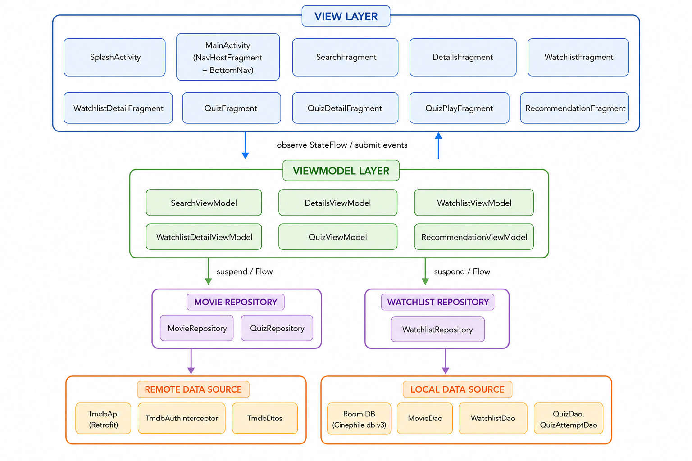

# Project Report — Cinephile

  

---

## Demo Video

A full walkthrough of the app is available in [`Cinephile_complete_description_video.mp4`](Cinephile_complete_description_video.mp4) at the root of the repository. It covers all main features with live narration.

---

## Introduction

This report covers the Cinephile Android application. The goal was to build a full movie exploration app using the TMDB API, covering search, ratings, favourites, watchlist management, a quiz system, and personalised recommendations.

This project was completed individually. All design decisions, code, debugging, and testing were done by one person. The solo context is mentioned where relevant, particularly in the contributions section.

The app is written entirely in Kotlin, follows an MVVM architecture, uses Room for local storage, Retrofit for API calls, and Jetpack Navigation for screen management.

---

## 1. App Functionalities

**Cinephile** is an Android application built for the mobile development course. It lets users search for movies via the TMDB API, rate and favourite them, manage personal watchlists, play quizzes generated from those watchlists, and get personalised movie recommendations based on their activity.

---

### Splash Screen

An animated logo plays on launch using `AnimatedImageDrawable` via `ImageDecoder`. Once the animation ends, the app navigates to `MainActivity`. A 5-second safety timer ensures navigation even if the animation callback never fires.

**Splash screen — animated Cinephile logo**

Black fullscreen background with the Cinephile logo centered on screen. The logo shows the red "C" icon with the app name underneath. The animation plays once on launch and the app navigates to the main screen automatically when it finishes. A 5-second timeout is also set in case the animation callback does not fire on slower devices.

---

### Search Screen

The search screen supports filtering by title, year, genre, actor, and director. It has two modes: a landing mode that shows only the app logo before any search, and a results mode that displays a 2-column scrollable grid of movies with poster, title, director, and release date. Long-pressing a result adds the movie directly to the current watchlist with a Snackbar confirmation. Pressing Android Back from results returns to the landing page instead of leaving the tab.

**Search landing page — empty state**

The main search page before any search is run. The Cinephile logo is centered in the upper part of the screen. Below it sits the search input field with a red search button and a filter toggle next to it. The bottom navigation shows the four tabs: Search, Watchlists, Quiz, and Discover. No results grid is shown yet since the app starts in landing mode.

**Search results — Scream movies**

The results grid after searching for "Scream". The logo and empty state disappear and the screen switches to a 2-column RecyclerView. Each card shows the movie poster, title, director name, and release year. Multiple entries from the Scream franchise are visible. Long-pressing any card would add that movie to the current watchlist directly.

**Advanced filter panel**

The filter panel expanded below the search bar. It shows separate input fields for year, genre, actor name, and director name, plus an Apply Filters button. The panel opens when the filter toggle button is tapped and lets the user narrow down results beyond just the movie title. All filters can be combined together in a single search.

**Filtered results — Fast and Furious**

Search results after applying filters for "fast and furious". The grid shows movies from the franchise and related action films like Into the Blue, Takers, Brick Mansions, and Pawn. The filter panel is still visible at the top showing the active filter state so the user knows a filter is applied.

---

### Details Screen

The details screen shows the full backdrop or poster, title, synopsis, release date, director, a horizontal cast strip, a `RatingBar` (0.5 to 5 stars, 0.5 step), a favourite toggle button, and a watchlist button. Ratings and favourites are saved locally in Room. Marking a movie as favourite automatically adds it to the special **Favorites** watchlist; unmarking removes it. The watchlist button opens a picker to choose which list to add the movie to, or to remove it if it is already in one.

**Movie details — add to watchlist button**

The detail page for Scream. At the top is a full-width backdrop image of the movie. Below it the poster thumbnail sits on the left with the title, director, and release date on the right. The star rating bar is shown but empty since the user has not rated it yet. Below that is the synopsis text and a horizontal scrollable cast strip showing actor photos and names. The "Add to Watchlist" button at the bottom confirms the movie is not yet saved in any list.

**Watchlist picker popup**

The movie details screen dimmed in the background with a dark modal dialog in the foreground. The dialog lists all available watchlists to choose from: Action, Horror, Watch Later, and others. Tapping one adds the movie to that list and closes the dialog. A Cancel button at the bottom lets the user close without doing anything.

**Remove from watchlist button**

Same Scream detail page but the watchlist button now reads "Remove from Watchlist" because the movie was added in the previous step. The star rating is still empty here. The rest of the screen looks identical, only the button label changed to reflect the current state.

**Movie saved in watchlist**

The Scream detail page after the user has both rated the movie and added it to a watchlist. The rating bar shows yellow stars filled to 3.5 out of 5. The watchlist button reads "Remove from Watchlist" confirming the movie is in a list. The synopsis and the horizontal cast carousel are visible below.

---

### Watchlist Screen

Users can create, rename, and delete named watchlists. There is always one **current** watchlist that receives movies added via long-press from other screens. A special **Favorites** watchlist (gold card, star icon) is created automatically on first launch. It cannot be renamed, deleted, or swiped away. All dialogs for creating and renaming use a custom dark style consistent with the cinema theme.

**Watchlists overview**

The Watchlists tab showing all the user's lists. The Favorites watchlist sits at the top on a gold card with a star icon and cannot be moved, deleted, or renamed. Below it are the user-created lists like Action, Horror, and Watch Later, each on a dark card. Every card has a pencil icon to rename it, a set-as-current button to switch the active watchlist, and a delete button. A floating action button at the bottom lets the user create a new list.

**Watchlist detail — Action list**

The inside of the Action watchlist showing all movies saved in it. Each row has the movie poster on the left, the title and some basic info on the right, and a trash icon to remove that movie from the list. Tapping a movie opens its full detail page. The list is scrollable if there are more movies than fit on screen.

**Rename watchlist popup**

A dark modal dialog overlaying the screen. It shows a text input pre-filled with the current watchlist name so the user can edit it directly without clearing it first. Cancel and OK buttons sit at the bottom in red. The keyboard opens automatically when the dialog appears.

**Delete confirmation popup**

A dark confirmation dialog asking the user to confirm deletion. It warns that the watchlist will be permanently removed. The Cancel and OK buttons are both styled in red to match the app theme. The Favorites watchlist never triggers this dialog since it is protected from deletion.

**Create new watchlist popup**

A dark modal with a text input pre-filled with a generated name like "Watchlist 3". The text is selected by default so the user can start typing a custom name immediately without manually clearing the field. Cancel closes the dialog, OK creates the new list and adds it to the watchlist screen.

---

### Quiz Screen

A quiz is tied to a watchlist and a difficulty level. Questions are generated automatically from the movies in that watchlist. There are three question types:

- **Release year** — "What is the release year of *[title]*?" — 3 wrong years offset by ±1 to 5 years
- **Director** — "Who directed *[title]*?" — wrong options taken from other movies in the watchlist
- **Actor** — "Which actor appeared in *[title]*?" — wrong options taken from the casts of other watchlist movies

Difficulty controls which types are available: EASY = year only, MEDIUM = year + director, HARD = all three. Each question has 4 options and a 15-second countdown timer. The score depends on response speed: fast (>10s left) = 3 pts, medium (>5s) = 2 pts, slow = 1 pt. Scores and attempt history are saved to Room.

**Quiz list**

The Quiz tab listing all created quizzes. Each card shows the quiz name, the watchlist it is based on, the difficulty badge (Easy, Medium, or Hard), and the last score achieved. Tapping a card opens the quiz detail screen. Long-pressing shows a delete option. A floating action button at the bottom starts the quiz creation flow.

**Select watchlist popup**

A dark modal that appears as the first step of quiz creation. It lists all available watchlists so the user can pick which one to base the quiz on: Favorites, Action, Horror, Watch Later, etc. The quiz questions will be generated from the movies in the selected list.

**Select difficulty popup**

The second step of quiz creation. A dark modal listing Easy, Medium, and Hard. Easy only generates release year questions. Medium adds director questions on top. Hard adds actor questions as well. The harder the difficulty the more types of questions can appear and the more knowledge of the movies is required.

**Quiz detail screen**

The detail page for the Action quiz set to Hard difficulty. It shows the quiz name, the associated watchlist, a trophy icon, and the difficulty badge. A large red Play button is centered on screen to launch the quiz. Below it the attempt history section shows past scores if the quiz has been played before.

**Quiz question with countdown timer**

The active quiz screen during a game. At the top a progress bar shows how much time is left out of the 15 seconds. The remaining seconds are shown as a number. Below is the question number out of the total (e.g. Question 3 of 10) and the question text asking about a specific movie. Four answer buttons are displayed below. After tapping one the correct answer turns green and any wrong answer turns red.

**Final score screen**

The end screen shown when all questions have been answered. It displays a "Quiz Finished" message and the final score, for example 3 out of a maximum of 12 points. The score depends on how fast each answer was given. An OK button closes the session and goes back to the quiz detail page where the new score is saved.

**Attempt history**

The quiz detail page after multiple play sessions. Below the Play button an attempt history section lists each past run with its score and the date it was played. For example 3/12 from one session and 6/12 from a later one. Each attempt is stored in the local Room database so the history persists across app restarts.

---

### Recommendation Screen

The Discover screen shows movies recommended based on the user's favourites and highly-rated movies (≥ 4 stars). The algorithm is entirely custom and does not use the TMDB recommendation endpoint. Genre filter chips let users narrow results to a specific genre. If no user profile exists yet, the screen falls back to popular movies so it is never empty on first use.

**Discover — all genres**

The Discover tab showing personalised movie recommendations. At the top is a horizontal scrollable row of genre filter chips covering categories like Action, Comedy, Drama, Horror and others. Below is a 2-column grid of recommended movies with their posters and titles. The movies shown are scored based on the user's favorites and ratings, so the results change as the user interacts with the app more.

**Discover — filtered by genre**

The same Discover page with one genre chip selected and highlighted in red. The movie grid has updated to show only movies that match the selected genre. The other chips stay unselected. This filter overrides the top genre from the user profile so they can explore a specific category even if it is not their most-watched genre.

---

## 2. Technical Architecture

### MVVM Overview

The app follows **MVVM (Model–View–ViewModel)** architecture with a clear separation between the data layer, business logic layer, and UI layer.

---

### Data Layer

**Remote:** `TmdbApi` is a Retrofit interface targeting `https://api.themoviedb.org/3/`. `TmdbAuthInterceptor` appends the Bearer token to every request. `HttpLoggingInterceptor` logs full request/response bodies in debug builds only (`BuildConfig.DEBUG`), and nothing in release.

**Local:** Room database `CinephileDatabase` (version 3) with five entities: `Movie`, `Watchlist`, `WatchlistMovieCrossRef`, `Quiz`, `QuizAttempt`. `List<Genre>` and `List<Actor>` fields are serialised to JSON strings by `Converters.kt` (Gson + Room `@TypeConverter`), because Room cannot store complex types natively.

**Repository:** `MovieRepository` uses a network-first strategy: fetch from TMDB, upsert into Room, return the Room `Flow`. On network failure the cached Room value is served transparently. `WatchlistRepository` and `QuizRepository` are thin wrappers over their DAOs, with `WatchlistRepository` also handling the Favorites watchlist creation at startup.

---

### ViewModel Layer

Each fragment has its own ViewModel. State is exposed via `StateFlow` and collected in fragments with `viewLifecycleOwner.lifecycleScope.launch`. No `LiveData` is used anywhere.

- `SearchViewModel` — holds filter state and search results across back-navigation.
- `DetailsViewModel` — loads movie from Room or TMDB; all DB writes use `withContext(NonCancellable)` so ratings and favourites survive back-navigation before the coroutine scope is cancelled.
- `WatchlistViewModel` / `WatchlistDetailViewModel` — full watchlist CRUD. `WatchlistDetailViewModel` merges two derived flows from a single `shareIn` upstream to avoid duplicate DAO queries.
- `QuizViewModel` — generates questions, manages the countdown timer, handles scoring, and persists attempt history.
- `RecommendationViewModel` — builds preference profile from favourites and ratings, scores Discover results, and provides `setGenreFilter()` for the chip filter.

---

### Navigation

A single `MainActivity` hosts a `NavHostFragment` wired to a `BottomNavigationView` (Search, Watchlists, Quiz, Discover) via `setupWithNavController`. The navigation graph (`nav_graph.xml`) uses **SafeArgs** for type-safe argument passing between fragments.

`SearchFragment` registers a custom `OnBackPressedCallback` (enabled only in results mode) so that Back returns to the logo landing page instead of leaving the tab.

---

### Recommendation Algorithm

The algorithm in `RecommendationViewModel.loadRecommendations()` works as follows:

1. Load all favourited and highly-rated (≥ 4 ★) movies from Room.
2. Build a preference profile: genre id frequencies, actor id set, director name set.
3. Fetch up to 3 pages of `/discover/movie` filtered by the top genre (or the user-selected chip override).
4. Score each candidate:
   - `+2` per genre match with any profile movie
   - `+1` per actor present in any favourite
   - `+1` if the director matches any favourite's director
   - Multiply total by the average user rating of the profile movies
5. Remove movies already in any watchlist or already rated by the user.
6. Sort descending, take top 20.

If no profile exists, the screen falls back to trending Discover results so it is never blank on first use.

---

### Quiz Generation Algorithm

`QuizViewModel.generateQuestions()` shuffles the watchlist movies and tries to build one question per movie via `tryBuildQuestion()`. Wrong answers for director and actor questions are pulled from other movies in the same watchlist. If the watchlist is too small to supply three distinct distractors, a hardcoded fallback list of well-known directors and actors is used. Year questions use random offsets in the ±1 to ±5 range.

---

## 3. Screenshot Index

| File | Description |
|---|---|
| `SH1 - Splash screen - Cinephile logo.png` | Launch screen with animated Cinephile logo |
| `SH2 - Search home - empty search bar.png` | Search landing page before any query is entered |
| `SH3 - Search results - Scream movies.png` | Search results for "Scream" displayed in a 2-column grid |
| `SH4 - Search filters panel.png` | Advanced filter panel (year, genre, actor, director) |
| `SH5 - Filtered search results - Fast and Furious.png` | Filtered results for the Fast and Furious franchise |
| `SH6 - Movie details - Scream add to watchlist.png` | Movie detail screen with add to watchlist button |
| `SH7 - Movie details - add to watchlist popup.png` | Watchlist picker popup |
| `SH8 - Movie details - Scream remove from watchlist.png` | Movie detail with remove from watchlist button |
| `SH9 - Movie details - Scream saved in watchlist.png` | Confirmation that the movie is saved in a watchlist |
| `SH10 - Discover page - all categories grid.png` | Discover page showing all genre recommendations |
| `SH11 - Discover page - movie category grid.png` | Discover page filtered by a specific genre chip |
| `SH12 - Watchlists overview.png` | Watchlist list with Favorites pinned at the top |
| `SH13 - Watchlist details - Action list.png` | Detail view of the Action watchlist |
| `SH14 - Watchlist rename popup.png` | Rename watchlist dialog |
| `SH15 - Watchlist delete confirmation popup.png` | Delete watchlist confirmation dialog |
| `SH16 - Watchlist create new popup.png` | Create new watchlist dialog |
| `SH17 - Quiz list overview.png` | List of created quizzes with last score |
| `SH18 - Quiz select watchlist popup.png` | Watchlist selection popup when creating a quiz |
| `SH19 - Quiz select difficulty popup.png` | Difficulty selection popup (Easy / Medium / Hard) |
| `SH20 - Quiz details - Action hard.png` | Quiz detail screen with Play button |
| `SH21 - Quiz question screen.png` | Quiz question screen with 4 options and countdown timer |
| `SH22 - Quiz finished score screen.png` | Final score screen after completing a quiz |
| `SH23 - Quiz details with attempt history.png` | Quiz detail showing previous attempt history |
