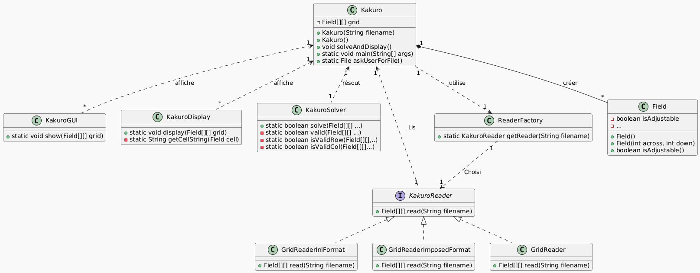
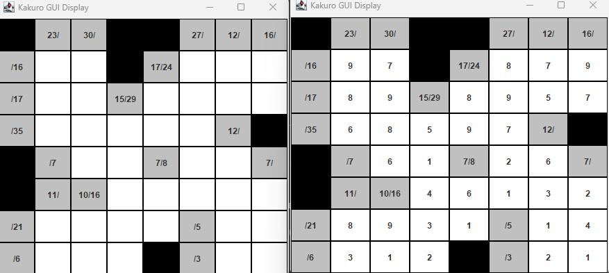

============================================================
                 KAKURO SOLVER – PROJET JAVA                             
============================================================

Ce projet est un solveur de grilles Kakuro développé en Java et swing.

Il permet de :
- Charger une grille depuis un fichier (.txt, .ini, ou symbolique)
- Résoudre automatiquement la grille avec un algorithme de backtracking
- Afficher la grille initiale et sa solution
  → en mode texte (console)
  → ou en interface graphique (Swing)

------------------------------------------------------------
PRÉREQUIS :
------------------------------------------------------------
• Java 11 ou supérieur installé
• Compilation du code source (ou exécution du .jar)
Pour activer l’affichage graphique (Swing), vous devez impérativement installer :
    sudo apt install openjdk-17-jdk
    sudo apt install libxrender1 libxtst6 libxi6 libxext6 libxrandr2 libx11-dev

❗️Sans ces bibliothèques, les options graphiques (2 et 3) peuvent possiblement provoquer une erreur.❗️

------------------------------------------------------------
LANCEMENT : IMPORTANT ! ❗️❗️❗️❗️❗️❗️❗️❗️❗️❗️
------------------------------------------------------------
1. Compilez depuis le dossier final/ :
Depuis le terminal :
javac -d bin src/*.java
2. Lancez le programme depuis le même endroit(final/) :
java -cp bin src.Kakuro

( Kakuro avec "J" majiscule ) .
❗️❗️❗️❗️❗️❗️❗️❗️❗️❗️❗️❗️❗️❗️❗️❗️❗️❗️❗️
------------------------------------------------------------

MENU DU PROGRAMME :
------------------------------------------------------------

1. Afficher et résoudre tous les puzzles du dossier "puzzles/"
   → Affichage texte dans le terminal

2. Choisir un fichier à résoudre
   → Sélection par une fenêtre, affichage terminal

3. Choisir un fichier et afficher la solution en GUI
   → Sélection par fenêtre, affichage graphique (Swing)

4. Choisir une difficulté
   → Facile, Moyenne, Difficile → fichier chargé automatiquement

5. Quitter le programme

------------------------------------------------------------
⚠️ REMARQUE :

------------------------------------------------------------
 Si vous ne voyez pas apparaître la fenêtre de sélection de fichier (dans les options 2 ou 3), il se peut qu’elle soit ouverte derrière la fenêtre active, selon votre configuration système ou environnement graphique. Essayez de réduire ou déplacer les fenêtres ouvertes pour la retrouver.

------------------------------------------------------------
ORGANISATION DES FICHIERS :
------------------------------------------------------------
• Field.java                      : Modélise une case de la grille

• Kakuro.java                    : Main du programme, centralise la logique

• KakuroSolver.java              : Résolution via backtracking

• KakuroReader.java              : Interface pour lecture de fichier

• GridReader*.java               : Lecteurs pour différents formats

• GridReaderImposedFormat.java  : Lecteur du format symbolique imposé (ex : _, #, 12/5)

• GridReaderIniFormat.java      : Lecteur du format INI structuré avec sections

• ReaderFactory.java             : Sélection dynamique du lecteur

• KakuroDisplay.java             : Affichage terminal

• KakuroGUI.java                 : Affichage graphique (Swing)

• puzzles/                       : Dossier contenant les grilles test

• src/                           : C’est ici que se trouvent tous les fichiers .java, organisés par packages
 
------------------------------------------------------------
FORMATS DE GRILLE SUPPORTÉS :
------------------------------------------------------------
• Format texte brut (.txt)
• Format imposé (symboles : _, #, 12/5...)
• Format INI structuré ([dimensions], [cells])

------------------------------------------------------------
AUTEUR : Miloudi Youcef
------------------------------------------------------------

